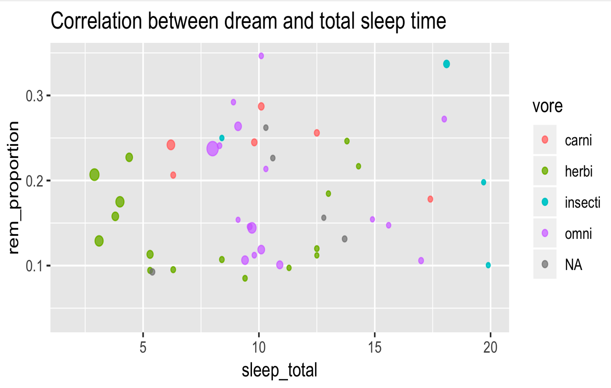
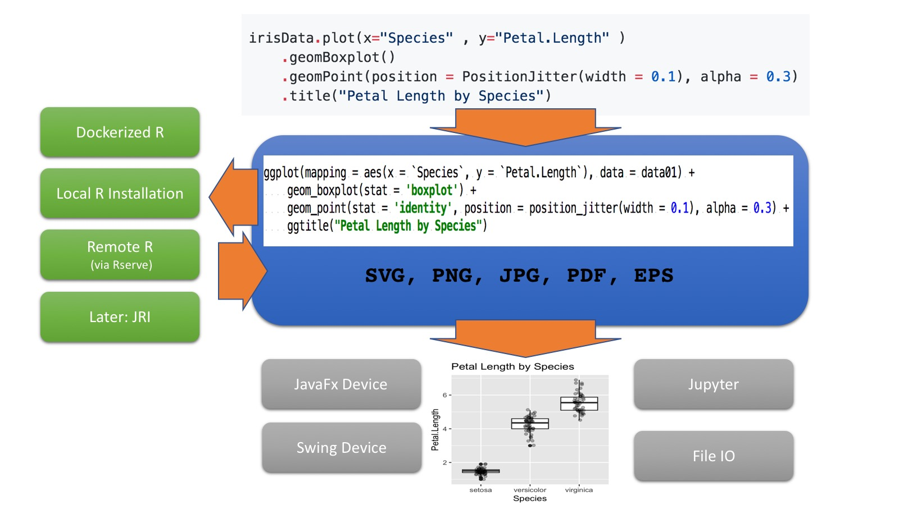
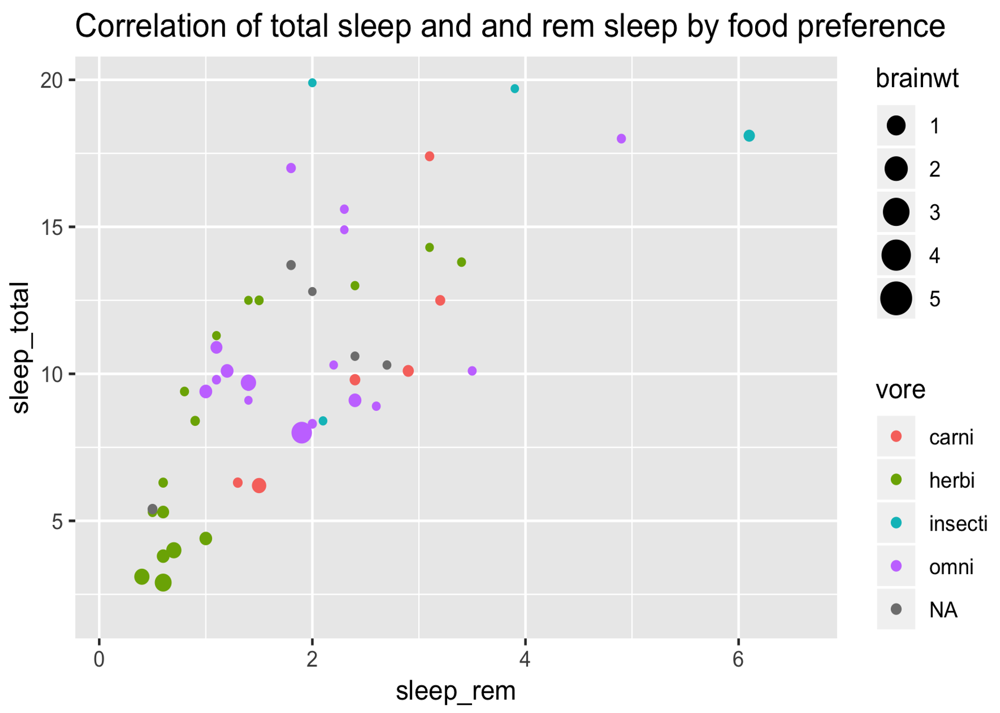
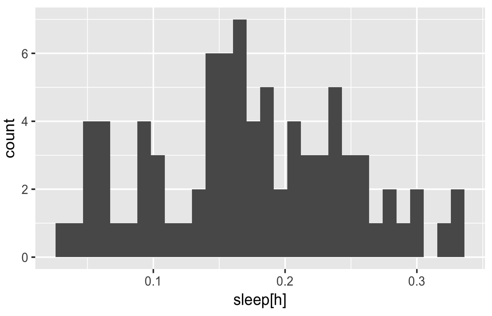
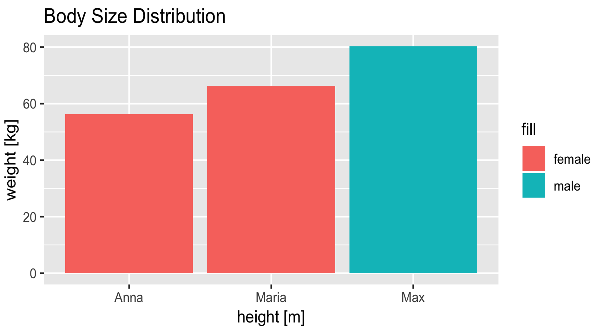
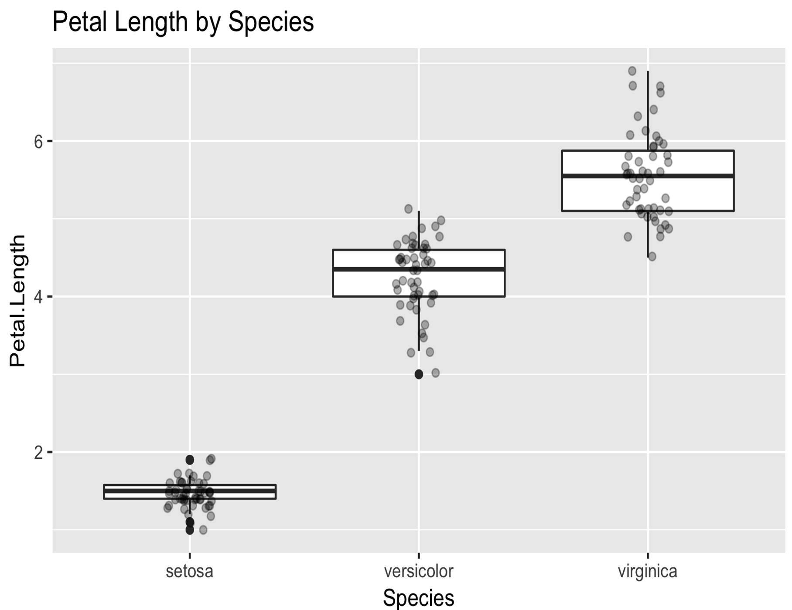
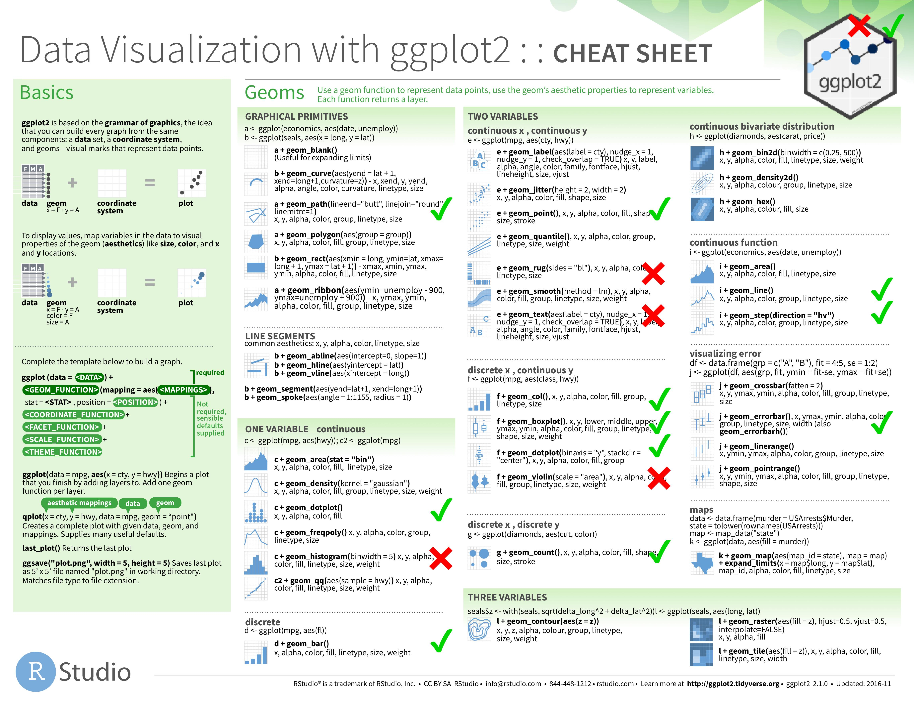
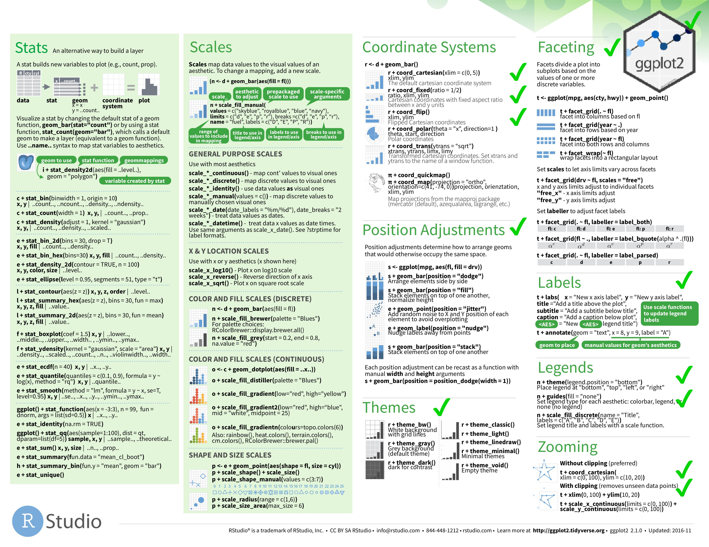
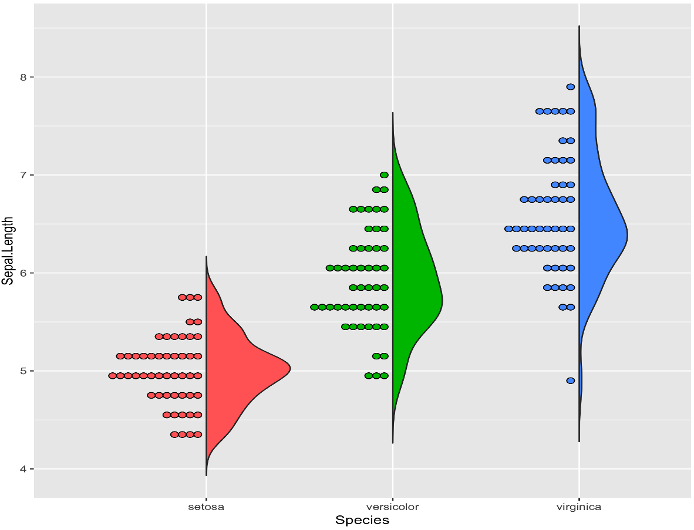

# `kravis` - A {k}otlin {gra}mmar for data {vis}ualization

 [  ](https://bintray.com/holgerbrandl/github/kravis/_latestVersion)
[](https://travis-ci.org/holgerbrandl/kravis)

Visualizing tabular and relational data is the core of data-science. `kravis` implements a grammar to create a wide range of plots using a standardized set of verbs.


The grammar implemented by `kravis` is inspired from [`ggplot2`](http://ggplot2.org/). In fact, all it provides is a more typesafe wrapper around it.  Internally, `ggplot2` is used as rendering engine. The API of `kravis` is highly similar to allow even reusing their excellent [cheatsheet](https://www.rstudio.com/resources/cheatsheets/#ggplot2).

R is required to use `ggplot`. However, `kravis` works with various integration backend ranging such as docker or remote webservices.


[TOC]: # " "

- [Setup](#setup)
- [First Example](#first-example)
- [The Grammar of Graphics](#the-grammar-of-graphics)
- [Module Architecture](#module-architecture)
- [Supported Data Input Formats](#supported-data-input-formats)
    - [Iterators](#iterators)
    - [Tables](#tables)
- [Output Devices](#output-devices)
- [Rendering](#rendering)
    - [(1) Local R](#1-local-r)
    - [(2) Dockerized R.](#2-dockerized-r)
    - [(3) Rserve](#3-rserve)
- [Plot Immutability](#plot-immutability)
- [API Coverage](#api-coverage)
    - [How to use missing API elements from ggplot2?](#how-to-use-missing-api-elements-from-ggplot2)
- [References](#references)
- [Acknowledgements](#acknowledgements)


---

**This is an experimental API and is subject to breaking changes until a first major release**

---

## Setup


Add the following artifact to your `gradle.build`

```
compile "com.github.holgerbrandl:kravis:0.4"
```

You can also use [JitPack with Maven or Gradle](https://jitpack.io/#holgerbrandl/kravis/-SNAPSHOT) to build the latest snapshot as a dependency in your project.

```groovy
repositories {
    maven { url 'https://jitpack.io' }
}
dependencies {
        compile 'com.github.holgerbrandl:kravis:-SNAPSHOT'
}
```

To build and install it into your local maven cache, simply clone the repo and run
```bash
./gradlew install
```


## First Example

Let's start by analyzing mamalian [sleep patterns](https://ggplot2.tidyverse.org/reference/msleep.html)
```kotlin
import krangl.*
import kravis.*

sleepData
    .addColumn("rem_proportion") { it["sleep_rem"] / it["sleep_total"] }
        // Analyze correlation
    .plot(x = "sleep_total", y = "rem_proportion", color = "vore", size = "brainwt")
        .geomPoint(alpha = 0.7)
        .guides(size = LegendType.none)
        .title("Correlation between dream and total sleep time")
```




Find more examples in our gallery **{comding soon}**.


## The Grammar of Graphics

`ggplot2` and thus `kravis` implement a **grammar for graphics** to build plots with

> `aesthetics` + `layers`  + `coordinates system` + `transformations` + ` facets`

Which reads as `map variables from data space to visual space` + `add one or more layers`  + `configure the coordinates system` + ` optionally apply statistical transformations` + `optionally add facets`. That's the way!


## Module Architecture



## Supported Data Input Formats

### Iterators

Every `Iterable<T>` is a valid data source for `kravis`, which allows to create plots using a type-save builder DSL. Essentially we first digest it into a table and use it as data source for visualization. Here's an example:

```kotlin
//  deparse records using property references (which will allow to infer variable names via reflection)
val basePlot = sleepPatterns.plot(
        x = SleepPattern::sleep_rem,
        y = SleepPattern::sleep_total,
        color = SleepPattern::vore,
        size = SleepPattern::brainwt
    )
            
basePlot
    .geomPoint()
    .title("Correlation of total sleep and and rem sleep by food preference")
    .show()
```



In the previous example  we have used property references. `kravis` also supports an extractor lambda function syntax, which allow for on-the-fly data transformations when deparsing an `Iterable<T>`. The ([not yet](https://github.com/holgerbrandl/kravis/issues/14) solved) disadvantage is that we need to assign axis labels manually

```kotlin
sleepPatterns
    .plot(x = { sleep_total/60 })
    .geomHistogram()
    .xLabel("sleep[h]")
```


And here's another example using a custom [data class](https://kotlinlang.org/docs/reference/data-classes.html):


```kotlin
enum class Gender { male, female }

data class Person(val name: String, val gender: Gender, val heightCm: Int, val weightKg: Double)

// define some persons
val persons = listOf(
    Person("Max", Gender.male, 192, 80.3),
    Person("Anna", Gender.female, 162, 56.3),
    Person("Maria", Gender.female, 172, 66.3)
)

// visualize sizes by gender
persons.plot(x = {name}, y = { weightKg }, fill = { gender.toString() })
    .geomCol()
    .xLabel("height [m]")
    .yLabel("weight [kg]")
    .title("Body Size Distribution")
```



### Tables

`kravis` can handle any kind of tabular data via [krangl](https://github.com/holgerbrandl/krangl) data-frames

```kotlin
import kravis.* 
import krangl.irisData 

irisData.plot(x="Species" , y="Petal.Length" )
    .geomBoxplot()
    .geomPoint(position = PositionJitter(width = 0.1), alpha = 0.3)
    .title("Petal Length by Species")
```




## Output Devices


`kravis` auto-detects the environment, and will try to guess the most reasonable output device to show your plots. The following output devices are available.

1. A swing graphics device for rendering when running in interactive mode.
1. A javaFX  graphics device for rendering when running in interactive mode.
3. It can render directly into files
4. will render directly into jupyter notebooks.

By default `kravis` will render as `png` on all devices, but it also supports vector rendering using `svg` as output format.


The preferred output can be configured using the `SessionPrefs` object

```kotlin
SessionPrefs.OUTPUT_DEVICE = SwingPlottingDevice()
```

## Rendering

Currently `kravis` provided 3 different options to bind an R engine which is required to render plots.

### (1) Local R

This is the default mode which can be configured by using

```kotlin
SessionPrefs.RENDER_BACKEND = LocalR()
```

### (2) Dockerized R.


```kotlin
SessionPrefs.RENDER_BACKEND = Docker()
```

This will pull and use by default the container [`rocker/tidyverse:3.5.1`](https://hub.docker.com/r/rocker/tidyverse/), but can be configured to use more custom images as needed.

### (3) Rserve

An (optionally) remote backend based using [Rserve](https://www.rforge.net/Rserve/)

Simply install the corresponding R package and start the daemon with

```bash
R -e "install.packages('Rserve',,'http://rforge.net/',type='source')"
R CMD Rserve
```

For configuration details see https://www.rforge.net/Rserve/doc.html

Alternatively, in case you don't have or want a local R installation, you can also run it dockerized locally or remotly with
```
# docker run -p <public_port>:<private_port> -d <image>  
docker run -dp 6311:6311 holgerbrandl/kravis_rserve 
```
See [Dockerfile](misc/docker_rserve/Dockerfile) for the spec of this image.

To use the Rserve backend, configure the kravis `SessionPrefs` accordingly by pointing to the correct host and port.
```kotlin
SessionPrefs.RENDER_BACKEND = RserveEngine(host="localhost", port=6302)
```

## Plot Immutability

Plots are -- similar to [`krangl`](https://github.com/holgerbrandl/krangl) data-frames -- immutable.

```kotlin
val basePlot = mpgData.plot("displ" to x, "hwy" to y).geomPoint()

// create one version with adjusted axis text size
basePlot.theme(axisText = ElementText(size = 20.0, color = RColor.red))

// create another version with unchanged axis labels but using a log scale instead
basePlot.scaleXLog10()

```

## API Coverage

Currently we just map a subset of the `ggplot2` API.




* Checks - implemented already
* Crosses - Planned but not yet done

Feel welcome to submit a ticket or PR if some important usecase is missing.


### How to use missing API elements from ggplot2?

Since `kravis` just mimics some parts of `ggplot2`, and because user may want to create more custom plots we do support preambles (e.g. to define new geoms) and custom layer specs.

Example

```kotlin
irisData.plot(x = "Species", y = "Sepal.Length", fill = "Species")
    .addPreamble("""devtools::source_url("https://git.io/fAiQN")""")
    .addCustom("""geom_flat_violin(scale = "count", trim = FALSE)""")
    .geomDotplot(binaxis = "y", dotsize = 0.5, stackdir = "down", binwidth = 0.1, position = PositionNudge(-0.025))
    .theme(legendPosition = "none")
    .labs(x = "Species", y = "Sepal length (cm)")
```




## References

You don't like it? Here are some other projects which may better suit your purpose. Before you leave, consider dropping us a [ticket](https://github.com/holgerbrandl/kravis/issues/ticket) with some comments about whats missing, badly designed or simply broken in `kravis`.

GGplot Wrappers

* [gg4clj](https://github.com/JonyEpsilon/gg4clj) Another ggplot2 wrapper written in java


Other JVM visualization libraries ordered by -- personally biased -- usefullness

* [SmilePlot](https://github.com/haifengl/smile#smileplot) provides data visualization tools such as plots and maps for researchers to understand information more easily and quickly.
* [XChart](https://github.com/timmolter/XChart) is a light-weight Java library for plotting data
* [data2viz](https://github.com/data2viz/data2viz) is a multi platform data visualization library with comprehensive DSL
* [Kubed](https://github.com/hudsonb/kubed/) is a Kotlin library for manipulating the JavaFX scenegraph based on data.
* [TornadoFX](https://github.com/edvin/tornadofx/wiki/Charts) provides some Kotlin wrappers around JavaFX
* [plotly-scala](https://github.com/alexarchambault/plotly-scala) which provides scala bindings for plotly.js and works within jupyter
* [breeze-viz](https://github.com/scalanlp/breeze/tree/master/viz) which is a
Visualization library backed by Breeze and JFreeChart
* [grafana](https://grafana.com/) is an open platform for beautiful analytics and monitoring
* [Jzy3d](http://www.jzy3d.org/) is an open source java library that allows to easily draw 3d scientific data: surfaces, scatter plots, bar charts

Other
* https://github.com/bloomberg/bqplot is a plotting library for IPython/Jupyter Notebooks


Vega-lite based
* [Vegas](https://github.com/vegas-viz/Vegas) aims to be the missing MatPlotLib for Scala + Spark
* [altair](https://github.com/altair-viz/altair) provides declarative statistical visualization library for Python
* [vega-embed](https://github.com/vega/vega-embed) allows to publish Vega visualizations as embedded web components with interactive parameters.
* [hrbrmstr/vegalite](https://github.com/hrbrmstr/vegalite) provides R ggplot2 "bindings" for Vega-Lite


## Acknowledgements

Thanks to vega-lite team for making this project possible.

Thanks to the ggplot2 team for providing the best data vis API to date.

