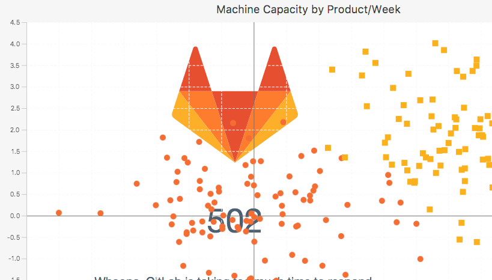

[TOC]: # " Contents"

# Contents
- [Milestoness](#milestoness)
    - [M1](#m1)
    - [M2](#m2)
    - [M3](#m3)
    - [later](#later)
- [Api design](#api-design)
- [Geoms](#geoms)
    - [boxplot](#boxplot)
- [geom_raster](#geom_raster)
    - [Scatter](#scatter)
    - [line plot with trends](#line-plot-with-trends)
- [JavaFX API](#javafx-api)
    - [legends](#legends)
    - [Theming](#theming)
    - [Rendering](#rendering)
        - [render in jupyter](#render-in-jupyter)
        - [basic reusable rendering device for kotlin repl](#basic-reusable-rendering-device-for-kotlin-repl)
        - [offscreen pdf renderin](#offscreen-pdf-renderin)
    - [svg output](#svg-output)
    - [misc](#misc)
- [Next steps](#next-steps)
    - [stats utils](#stats-utils)
    - [Reading List](#reading-list)
- [Backlog](#backlog)
    - [rserve backend](#rserve-backend)
- [R packaging](#r-packaging)


# Milestoness

## M1

Replicate more examples from library https://www.r-graph-gallery.com/

* Render with current panel size
* Add swing/fx svg renderer
* Fix FX renderer

* remap vega errors to throwables
https://stackoverflow.com/questions/15522315/how-to-get-the-javafx-webengine-to-report-errors-in-detail

geom
* barchart
* linebarcht with trend (lm and loess)
* scatter (size, alpha, text)
* histogram (color, alpha)
* plot chart background images (e.g. cells)

infrastrcuture
* render in jupyter
    * see https://stackoverflow.com/questions/39739476/use-javafx-chart-api-to-draw-chart-image
* 
* basic reusable rendering device for kotlin repl
* offscreen pdf renderin

## M2

check out https://github.com/hudsonb/kubed again

* cover most examples from altair/vega-lite
* git rid of pointless jframe dummy
* duplicated encoding channels should throw exception


## M3

* Support `rserve` as alternative rendering engine


## later

should pca and/or tSNE go into kravis or other artifact

for nice impl see https://github.com/lejon/T-SNE-Java

other impl https://deeplearning4j.org/doc/org/d

---
https://lankydanblog.com/2017/01/29/javafx-graphs-look-pretty-good/

write ui components with fxml

---
https://github.com/kairikozuma/scatter-plot

complete app article with table and data view


# Api design

see examples on https://knowm.org/open-source/xchart/xchart-example-code/


# Geoms

## boxplot

http://irondukepublishing.github.io/waterlooFX/

# geom_raster

how does ggplot actually work here --> see TM

this works somehow /Users/brandl/projects/kotlin/kravis/src/test/kotlin/com/github/holgerbrandl/kravis/tornadofx/ScatterTheme.kt
```
.chart-plot-background {
    /*-fx-background-color: #dadada;*/
    -fx-background-color: transparent;
    -fx-background-image: url("Clipboard.png");
}

```


but we'd like to set it programmatically and rescale the image as needed


## Scatter

* [x] different point sizes
    * bubble makes it easy but is ellipsoid
* [x] different alphas
* [x]text labels
* [x] color-map (gradient, discrete)
* legends for all aes
* [x] category axis (bubble does not support it, scatter does)
* log axis (see https://stackoverflow.com/questions/14459923/javafx-2-x-logarithmic-scale-on-y-axis)

## line plot with trends

* trendline(s) overlay
scatter with trend

1. model with lm
2. sample points
3. spline through points using in http://fxexperience.com/2012/01/curve-fitting-and-styling-areachart/


# JavaFX API

> JavaFX charts are an evil piece of code


---
 https://stackoverflow.com/questions/38106407/javafx-scatterchart-how-to-set-icon-for-data-points

```
// but these are absolute positions
for (d in series1.getData()) {
d.node = circle(x, y, 30)
}
```

---
https://stackoverflow.com/questions/20983131/remove-javafx-2-linechart-legend-items
You can find a node based on it's type (and optionally style name) using this method:

```
Legend legend = (Legend) findNode(chart, Legend.class.getName(), "chart-legend");
```

---
stacking charts
https://stackoverflow.com/questions/28788117/stacking-charts-in-javafx


## legends

see `/Users/brandl/projects/kotlin/kravis/src/test/kotlin/com/github/holgerbrandl/kravis/javafx/legends`

Move legends https://stackoverflow.com/questions/30301458/how-to-show-legends-inside-linechart-area

```
for (Node n : lineChart.lookupAll(".chart-legend")) {
    n.setTranslateY(-200);
}
```
or via css
```
.chart-legend{
     -fx-translate-y: -200;
}
```

all css https://docs.oracle.com/javafx/2/api/javafx/scene/doc-files/cssref.html#legend

---
hide legend

https://stackoverflow.com/questions/20983131/remove-javafx-2-linechart-legend-items

`chart.setLegendVisible(false) `


https://stackoverflow.com/questions/34881129/javafx-scatter-chart-custom-legend

---
https://stackoverflow.com/questions/44956955/javafx-use-chart-legend-to-toggle-show-hide-series-possible --> register mouse click listener on legned items

## Theming

From https://books.google.de/books?id=Wb8ICAAAQBAJ&pg=PA984&lpg=PA984&dq=javafx+bubble+circle+not+ellipsis&source=bl&ots=_9czWEf41V&sig=8mDa8ytbdZruTz_ynND1FPDwZLA&hl=de&sa=X&ved=0ahUKEwjprLe34cLXAhUMalAKHUzyCdEQ6AEIQDAD#v=onepage&q=javafx%20bubble%20circle%20not%20ellipsis&f=false


## Rendering


### render in jupyter

https://stackoverflow.com/questions/13232578/rendering-javafx-2-charts-in-background

### basic reusable rendering device for kotlin repl

### offscreen pdf renderin


## svg output

show svg in javafx window

https://stackoverflow.com/questions/12436274/svg-image-in-javafx-2-2


https://stackoverflow.com/questions/26948700/convert-svg-to-javafx-image

as pdf use batik https://stackoverflow.com/questions/6875807/convert-svg-to-pdf
which has encoders for all types

## misc

use canvas mode in javafx2.2 for better performance
http://www.canoo.com/blog/2012/09/21/take-care-of-the-javafx-scene-graph/?lang=de

# Next steps


## stats utils

http://commons.apache.org/proper/commons-math/javadocs/api-3.6/overview-summary.html


## Reading List

---
Explore https://github.com/hudsonb/kubed/


cool demos
/Users/brandl/projects/kotlin/misc/kubed/kubed-demos/src/main/kotlin/kubed/demo/StackedBarChartDemo.kt

---
https://github.com/HanSolo/charts


---
TornadoFX

https://github.com/edvin/tornadofx/wiki/Charts


https://edvin.gitbooks.io/tornadofx-guide/content/part1/8.%20Charts.html

https://github.com/edvin/tornadofx/wiki/Charts


for impl see /Users/brandl/projects/kotlin/misc/tornadofx/src/main/java/tornadofx/Charts.kt

---
JavaFx Charts

https://docs.oracle.com/javafx/2/charts/chart-overview.htm


custom chart are possible with fxml
https://stackoverflow.com/questions/33308877/fxml-custom-chart

https://stackoverflow.com/questions/26803380/how-to-combine-scatter-chart-with-line-chart-to-show-line-of-regression-javafx

https://gist.github.com/jewelsea/3668862

https://github.com/JKostikiadis/MultiAxisScatterChart

http://thorwin.blogspot.de/2015/03/trend-curveline-in-javafx-chart.html

---
https://github.com/jfree/jfreesvgO


---
https://jtablesaw.wordpress.com/tag/visualization/

histogram, boxplots


# Backlog

* render svg
  * https://stackoverflow.com/questions/12436274/svg-image-in-javafx-2-2
  * https://stackoverflow.com/questions/20664107/draw-svg-images-on-a-jpanel


###  rserve backend

See https://www.rforge.net/Rserve/

Use existing docker https://github.com/stevenpollack/docker-rserve

Rserve examples
* https://stackoverflow.com/questions/17395651/calling-ggplot-from-rserve-blank-png-image-of-1kb
* Pushing data into rserve seems reasonably easy https://github.com/knime-mpicbg/knime-scripting/blob/84693d96ff8d3282d0477432fe5435ae1cca3ebe/de.mpicbg.knime.scripting.r/src/de/mpicbg/knime/scripting/r/AbstractRScriptingNodeModel.java#L295

# R packaging

Seems possible for windows https://sourceforge.net/projects/rportable/

Seems possible for macos
* https://superuser.com/questions/939070/a-self-contained-r-in-os-x
* https://superuser.com/questions/946083/will-my-portable-app-portable-r-work-on-both-my-pc-and-mac

Not feasible for
https://stackoverflow.com/questions/11871394/create-r-binary-packages-for-linux-that-can-be-installed-on-different-machines

Maybe usefful:
* https://github.com/r-hub/homebrew-cran building statically linked R binary packages for MacOS based on homebrew

